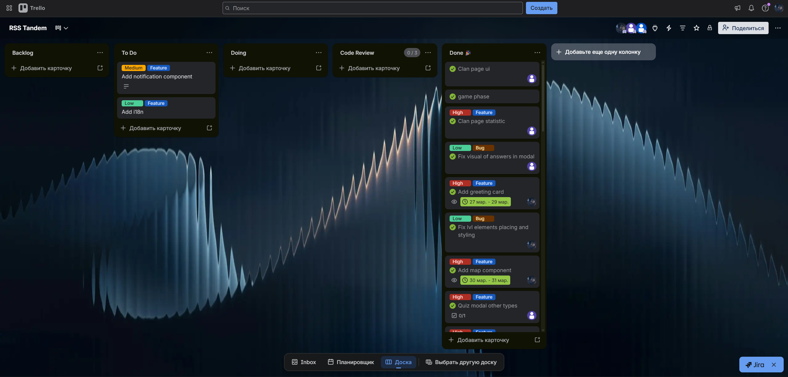

# Sea of Code

### [**Deploy**](https://sea-of-code-9to52eqj6-ch-alexandras-projects.vercel.app/)

## Description

As part of the project, our team developed an educational web application with gamification elements. The core concept is learning programming through a game inspired by Battleship: the user answers questions on a selected topic, and correct answers allow them to attack the opponent’s ships.

## Demo

- https://youtu.be/XuFJ_b9bL6g

## What we are proud of

We are proud of taking our first serious steps in real-world development as a team. Our application helps users improve their programming skills in a fun, game-like environment. For many of us, this project was our first experience working with React, Tailwind, and deploying an application with Vercel, which made the development process both challenging and exciting. We also successfully integrated Firebase for authentication and data storage. Overall, the project helped us gain valuable experience with modern frontend tools and the full development workflow.

## Team

- Maxim ([orgris](https://github.com/Orgris)) - [dev-notes](https://github.com/Auto-Team-9/sea-battle/tree/development-notes/development-notes/orgris)
- Andrey ([heyArtik-dev](https://github.com/heyArtik-dev)) - [dev-notes](https://github.com/Auto-Team-9/sea-battle/tree/development-notes/development-notes/heyArtik-dev)
- Alexandra ([Ch-alexandra](https://github.com/Ch-alexandra)) - [dev-notes](https://github.com/Auto-Team-9/sea-battle/tree/development-notes/development-notes/Ch-alexandra)

## Kanban board

[**Trello**](https://trello.com/b/uKf8wGni/rss-tandem)



## Best PRs

- [feat/add greeting card](https://github.com/Auto-Team-9/sea-battle/pull/28)
- [feat/Quiz modal base functional and ui](https://github.com/Auto-Team-9/sea-battle/pull/25)
- [feat/game](https://github.com/Auto-Team-9/sea-battle/pull/16)
- [feat/Add Auth Validation](https://github.com/Auto-Team-9/sea-battle/pull/13)

## Local Setup

### Prerequisites

- [Node.js](https://nodejs.org/) v18+
- npm v9+

### Steps

1. **Clone the repository**

   ```bash
   git clone https://github.com/Auto-Team-9/sea-battle.git
   cd sea-battle/sea-of-code
   ```

2. **Install dependencies**

   ```bash
   npm install
   ```

3. **Configure environment variables**

   Create a `.env` file in the `sea-of-code/` directory:

   ```env
   VITE_FIREBASE_API_KEY=your_api_key
   VITE_FIREBASE_AUTH_DOMAIN=your_project.firebaseapp.com
   VITE_FIREBASE_PROJECT_ID=your_project_id
   VITE_FIREBASE_STORAGE_BUCKET=your_project.appspot.com
   VITE_FIREBASE_MESSAGING_SENDER_ID=your_sender_id
   VITE_FIREBASE_APP_ID=your_app_id
   VITE_FIREBASE_DATABASE_URL=your_measurement_id
   ```

   Get these values from your [Firebase Console](https://console.firebase.google.com/) → Project Settings → Your apps.

4. **Start the dev server**

   ```bash
   npm run dev
   ```

   The app will be available at `http://localhost:5173`.

### Other useful commands

| Command           | Description                        |
| ----------------- | ---------------------------------- |
| `npm run build`   | Production build                   |
| `npm run preview` | Preview the production build       |
| `npm run lint`    | Lint and auto-fix TypeScript files |
| `npm run format`  | Format all files with Prettier     |
| `npm run test`    | Run unit tests with Vitest         |

## Meeting Notes

- https://youtu.be/ct0m-CUmHCY
- https://youtu.be/astQVLX8AkU
- https://youtu.be/mG4roJoLJmY