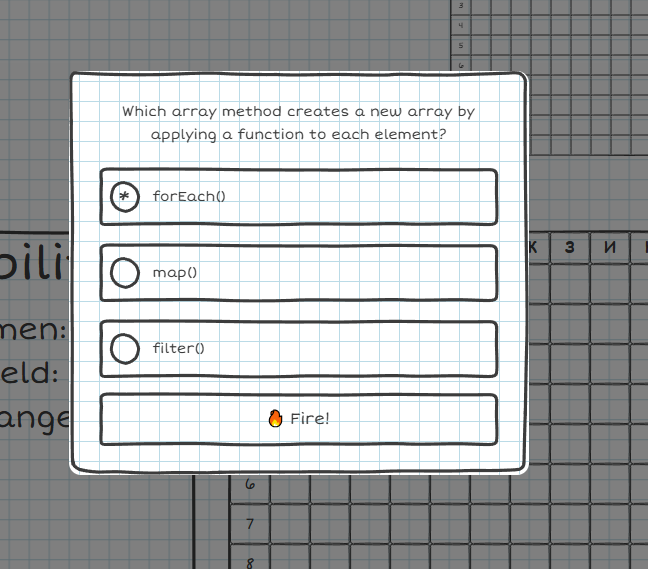

# Дата: 2026-03-19

Отрисовала модалку с дефолтным вопросом. Долго провозилась с тем, чтобы поставить необходимый фон в клетку на саму модалку. Налепила лишних контейнеров и искала как это исправить После разбила её на отдельные компоненты в файлы. Получилось симпатично. 

Очень раздражает, что пока нет кнопок для перехода по страницам...

Вечером был небольшой созвон с ребятами, показала, что успела сделать. 

Начала разбираться с firebase, чтобы составить банк вопросов и подключить их для простого базового типа. Это ближайшая задача.

Подумала, что можно добавить вопросы с редактированием кода и drag'n'drop для кораблей посложнее. Нужно обсудить с ребятами сложность вопросов и уровней, потому что я пропустила эту часть обсуждений, если она была.

>где-то 5 часов в сумме

