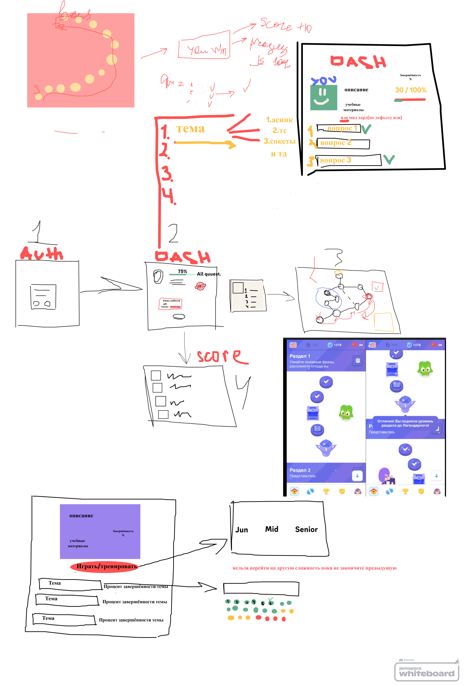

# Дата: 2026-02-23

Сравнил варинаты реализации бэка. После обсуждения решили, что у нас не хватает времени на разработку кастомного бэка и выбрали Firebase. У меня уже был какой-то опыт + у Firebase встореная auth. Кроме того (сейчас) кажется, что сложная бизнес-логика на сервере нам не нужна. Устроили brainshtorm по теме с разработкой макета приложения. 
В ходе обсуждения решили, что концепт недостаточно "игра". Придумали новый концепт на основе игры "Морской Бой" с вопросами/выстрелами. Решили ещё пару дней подумать над этим. Также на следующей неделе нужно быстро сделать скелет приложения со всеми требованиями Code Standards. Также стоит углубиться в React и настроить CI/CD.
