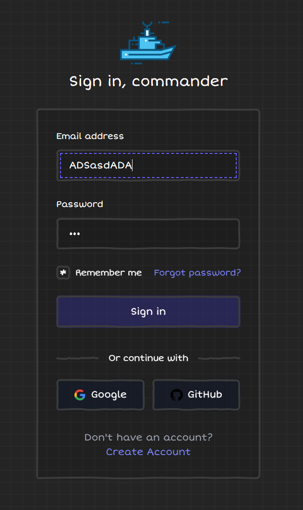
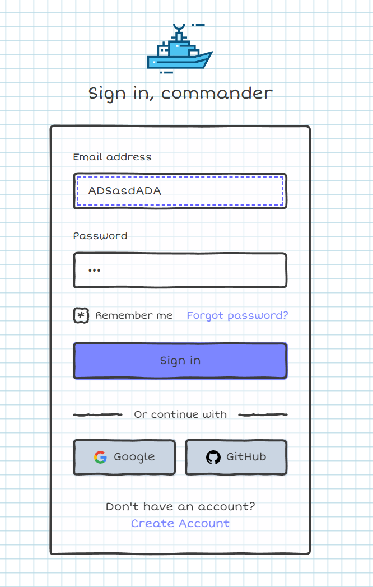

# Дата: 2026-03-08

Сделал форму авторизации. И пару переиспользуемых компонентов (кнопка и инпут). К дедлайну недели нужно подключить Firebase Auth и доделать этот feature. Не пожалел, что согласился делать приложение на React. Хоть и тяжело, но по ощущениям удобней. Пока логин выглядит так:

- **Проблемы:** Нужно создать профиль в Firebase и подключить.
- **Затраченное время:** 3 часа

