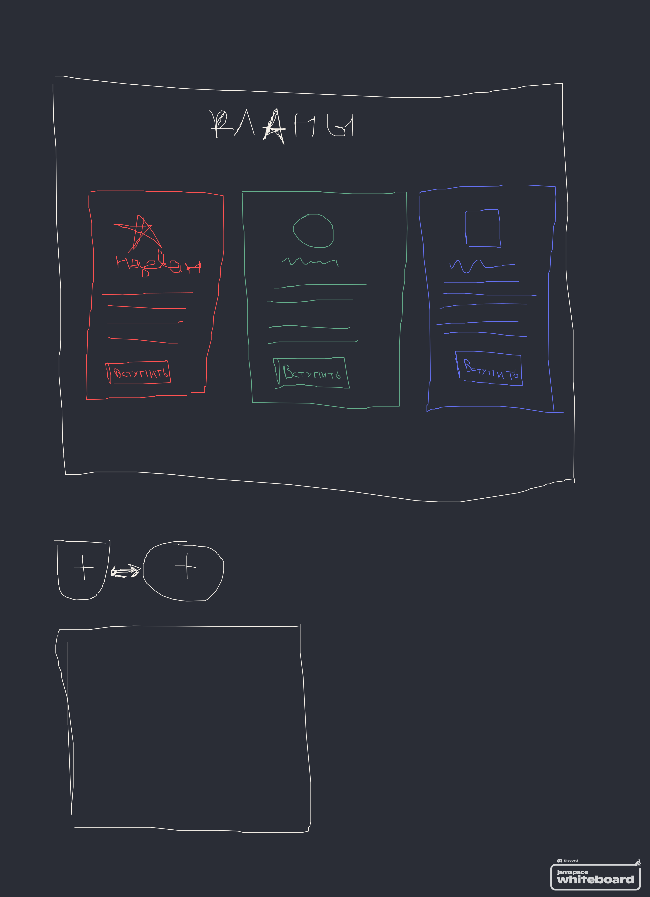
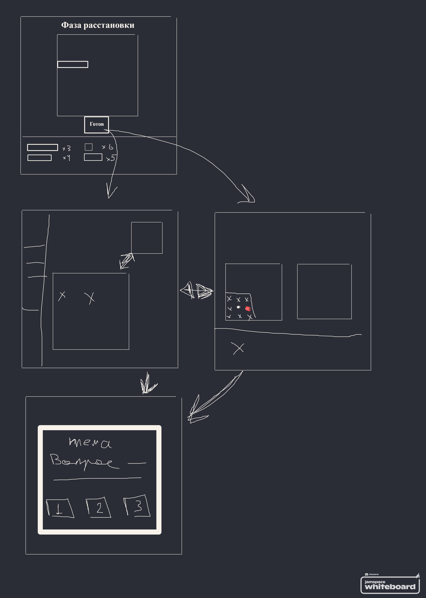

# Дата: 2026-03-14

Обсудили с Андреем страницы кланов/фракций и игры. Также нарисовали пару простых схем интерфейса и основного flow. Страница фракций при первом входе предложит выбор фракции, а далее будет отображать статистику фракции, статистику игрока в выбранной фракции и сравнительную статистику фракций. Накидали пару вариантов игрового интерфейса. Каждый вариант имеет свои плюсы и минусы. Андрей будет далее изучать вопрос, и позже мы снова его обсудим.

В ходе недели подключили Firebase. Обсуждали, какую БД выбрать: Realtime Database или Cloud Firestore. Взвесив всё, сошлись на Cloud Firestore. Для нас важнее выборка, чем обновление в реальном времени.

К этому моменту Андрей уже добавил инициализацию бд и я продолжу работу над Auth. Буду стараться успеть с Auth и Checkpint 4 до вторника.

- **Проблемы:** Доделать Auth скриин, интегрировать OAuth и смену пароля через почту.
- **Затраченное время:** 2 часа

