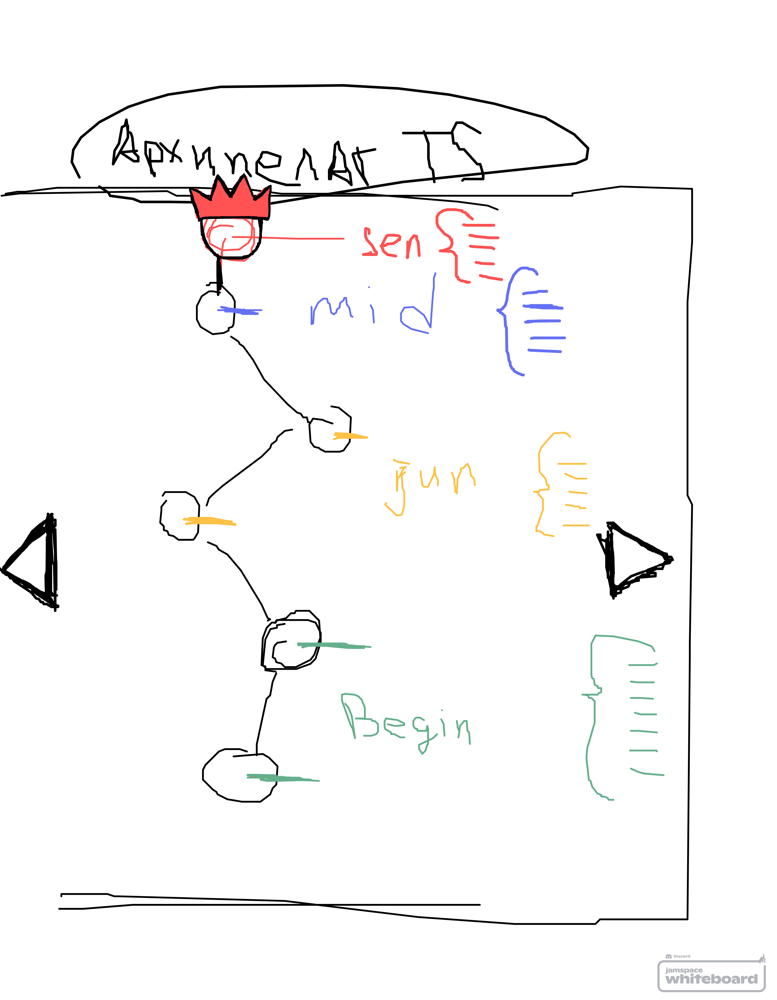

# Дата: 2026-03-23

Наконец-то доделал Auth. Смог реализовать хук для получения свежих данных о пользователе из Firebase Auth и Firestore. Также сделал переиспользуемый компонент для нотификаций и загрузки. Реализовал protected/public routes. Перехожу на главный экран с выбором уровней

Встретились с ребятами и обсудили логику выбора уровней на главном экране. Цепочка уровней наподобие Duolingo. У каждого уровня своя сложность, и вопросы будут подбираться по этой сложности из пула. Думаем записать это в хранилище типа слоя modal и прокидывать в Game.

